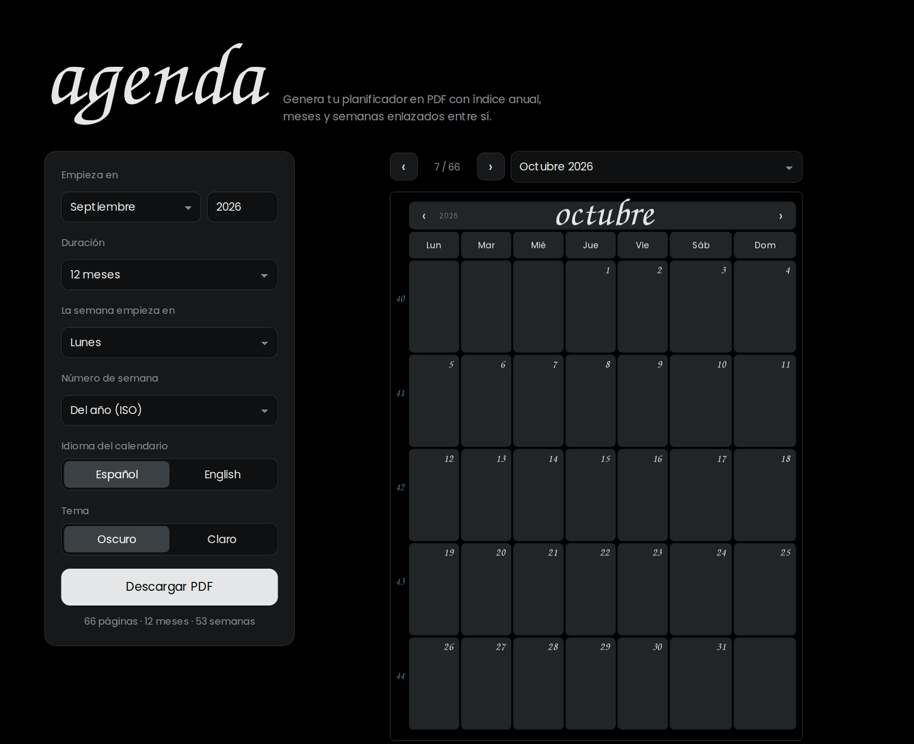
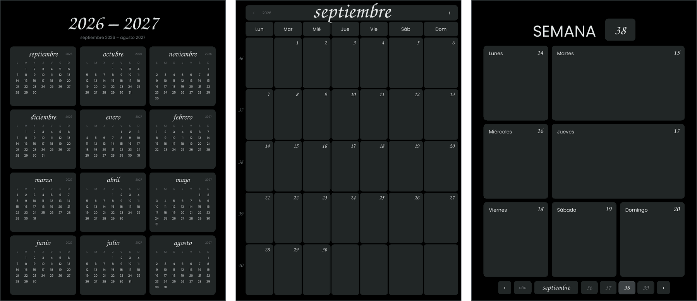
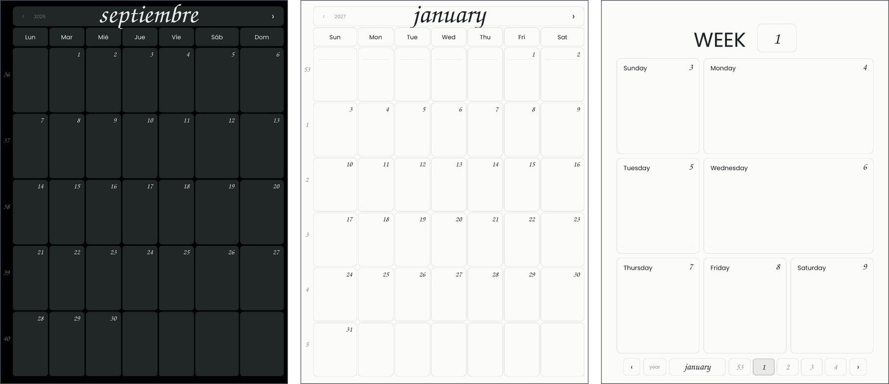
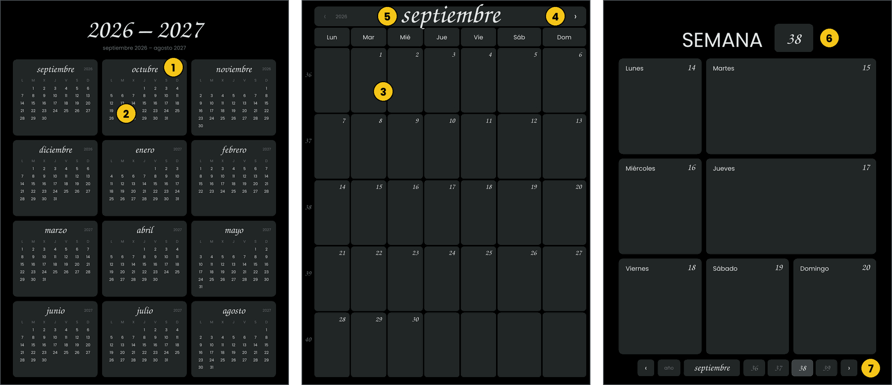

# agenda

**Crea tu agenda digital en PDF en un minuto.** Eliges cuándo empieza el año y la semana, y descargas un planificador con índice anual, meses y semanas enlazados entre sí, listo para usar en la tablet con GoodNotes, Notability o cualquier app de notas.

### 👉 [Crear mi agenda](https://TU_USUARIO.github.io/agenda-pdf/)

Gratis, sin registro y sin instalar nada.

---

## Qué incluye tu agenda

- **Índice del año.** Los 12 meses de un vistazo, en miniatura.
- **Una página por mes.** Una cuadrícula con espacio para escribir en cada día y el número de semana a la izquierda de cada fila.
- **Una página por semana.** Una casilla amplia para cada día, con hueco de sobra para tareas, citas o notas.

Todo está enlazado: tocas un día y vas a su semana, tocas el mes y vuelves atrás. No hace falta pasar páginas.

## Cómo crearla

**1. Elige las opciones**

| Opción | Para qué sirve |
| --- | --- |
| **Empieza en** | El mes y el año con que arranca la agenda. Puede ser enero, septiembre para el curso escolar o el mes que quieras. |
| **Duración** | Cuántos meses incluye: 3, 6, 12, 18 o 24. |
| **La semana empieza en** | El día que abre cada semana: lunes, domingo o cualquier otro. |
| **Número de semana** | *Del año* usa la numeración oficial (la semana 1 es la primera semana de enero). *Desde el inicio de la agenda* cuenta 1, 2, 3… a partir de la primera semana. |
| **Idioma del calendario** | Español o inglés, para los nombres de meses y días. |
| **Tema** | Oscuro o claro. |

**2. Revisa la vista previa**

La vista previa muestra exactamente lo que vas a descargar. Puedes pasar páginas con las flechas, saltar a un mes con el desplegable o tocar la propia vista previa, porque los enlaces ya funcionan.

**3. Descarga el PDF**

Pulsa **Descargar PDF**. La agenda se genera en tu propio dispositivo al momento.

**4. Ábrelo en tu app de notas**

Importa el PDF en GoodNotes, Notability, Noteshelf o la app que uses, normalmente con la opción *Importar* o *Abrir en…*, y empieza a escribir.

> [!TIP]
> En la mayoría de apps, los enlaces solo responden cuando no tienes seleccionado el lápiz. Cambia al modo de lectura o a la herramienta de mano para navegar, y vuelve al lápiz para escribir.

## Cómo moverte por la agenda

| | Si tocas… | Vas a… |
| --- | --- | --- |
| **1** | el nombre de un mes en el índice | la página de ese mes |
| **2** | un día del índice | la semana de ese día |
| **3** | un día del mes, o el número de semana de la izquierda | esa semana |
| **4** | las flechas ‹ › del mes | el mes anterior o el siguiente |
| **5** | el nombre del mes o el año | el índice |
| **6** | «SEMANA» y su número | el mes |
| **7** | la barra inferior de la semana | la semana anterior o siguiente, otra semana del mes, el mes o el índice (botón «año») |

El número de cada día en la página semanal también te lleva a su mes. Además, el PDF tiene marcadores: abre el índice lateral de tu lector y verás los meses y, dentro de cada uno, sus semanas.

## Compartir tu configuración

Las opciones que eliges quedan guardadas en la dirección de la página. Copia el enlace del navegador y quien lo abra verá la agenda con tu misma configuración. Es útil para compartir con tu clase, tu equipo o para volver a crear la del año siguiente.

## Preguntas frecuentes

**¿Se envían mis datos a algún sitio?**
No. La agenda se crea en tu navegador y no pasa por ningún servidor.

**¿Por qué algunas semanas tienen días de otro mes?**
Las semanas no siempre empiezan el día 1. Cada semana aparece una sola vez, dentro del mes que tiene más días de esa semana. Cuando empieza un mes a mitad de semana, el día 1 lleva el nombre abreviado del mes para que se note el cambio.

**¿Qué numeración de semanas elijo?**
Si usas los números de semana en el trabajo o en el calendario de tu móvil, elige *Del año*. Si prefieres contar las semanas de un curso o un proyecto desde su inicio, elige *Desde el inicio de la agenda*.

**¿Puedo imprimirla?**
Sí. La página tiene formato 3:4 y se ajusta al papel al imprimir. Los enlaces, lógicamente, solo funcionan en la versión digital.

**¿Cuántas agendas puedo crear?**
Todas las que quieras, con las opciones que quieras.

---

¿Quieres saber cómo funciona por dentro o publicar tu propia copia? Consulta la [guía técnica](docs/DESARROLLO.md).

Código con licencia [MIT](LICENSE). Las tipografías tienen sus propias licencias, incluidas en [`fonts/`](fonts/).
